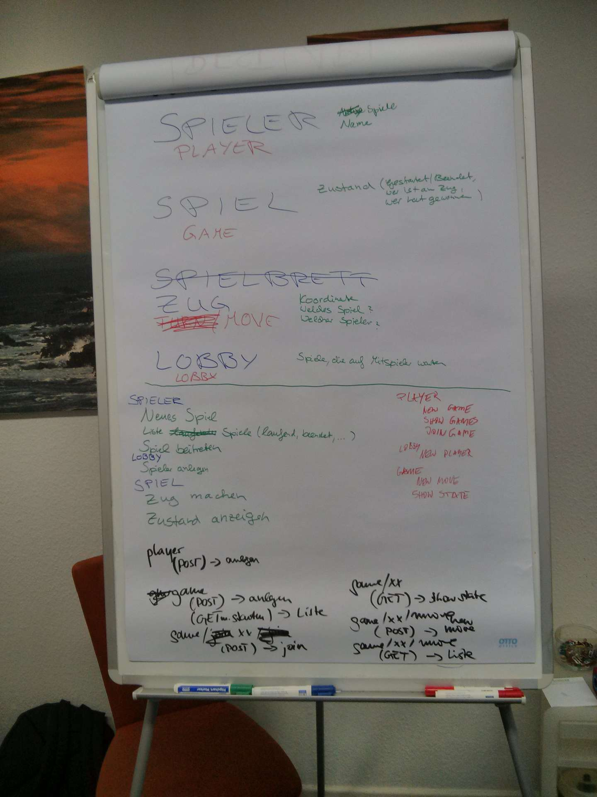

jaxrsrestapi
============

A first JAX-RS for Wildfly Implementation

#Player#

##create a new player##

URL: /player

HTTP METHOD POST: { name: "user name" }

RESPONSE: { playerid: 123 }

#GAME#

##create a new game##

URL: /game

HTTP METHOD POST: { playerid: 123 }

RESPONSE: { gameid: 123 }

##list all games with one player##

URL: /game

HTTP METHOD GET

RESPONSE: [ { games: { gameid: 123 }, { gameid: 456 } } ]

##join a game##

URL: /game/{ gameid: 123 }

HTTP METHOD POST: { playerid: 789 }

RESPONSE: HTTP 204 NO CONTENT

##create a new move##

URL: /game/{ gameid: 123 }/move

HTTP METHOD POST: [ { playerid: 123 }, { field: B1 } ]

RESPONSE: HTTP 204 NO CONTENT

##get moves##

URL: /game/{ gameid: 123 }/move

HTTP METHOD GET

RESPONSE: [ { moves: { moveid: 123 }, { moveid: 456 } } ]

##show game state##

URL: /game/{ gameid: 123 }

HTTP METHOD GET

RESPONSE: [ { players: { player: { playerid: 789 }, player: { playerid: 012 } }, state: { OPEN | RUNNING | FINISHED }, next: { playerid: 123 }, winner: { playerid: 123 } ]
